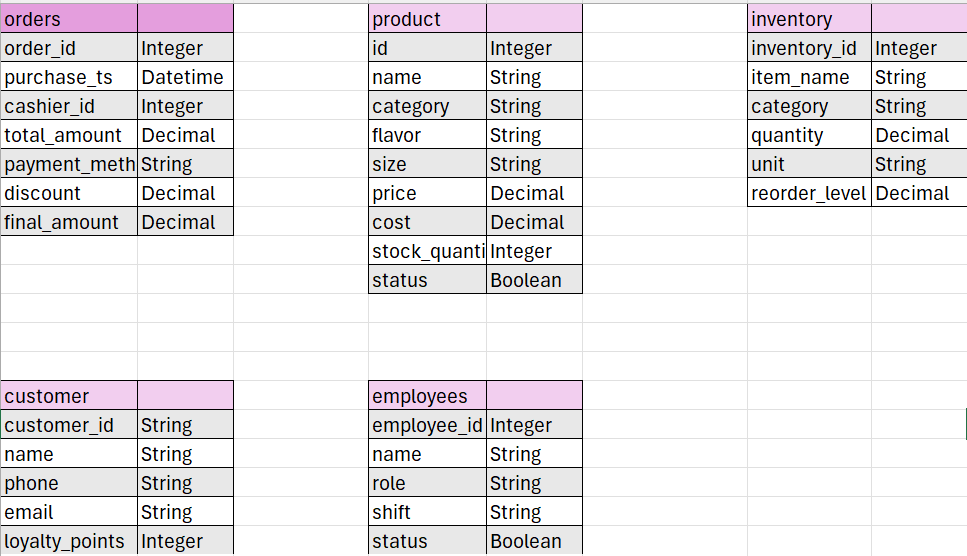
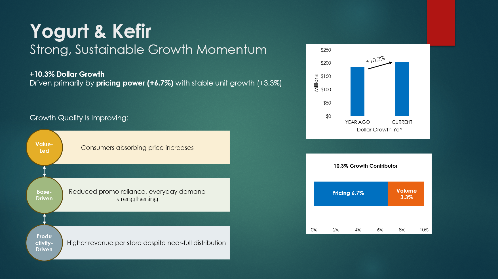
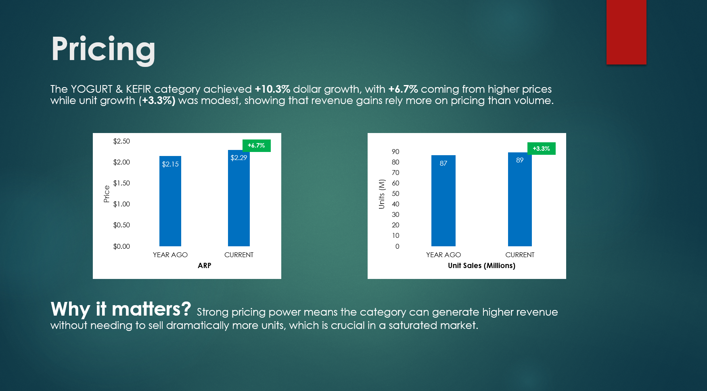
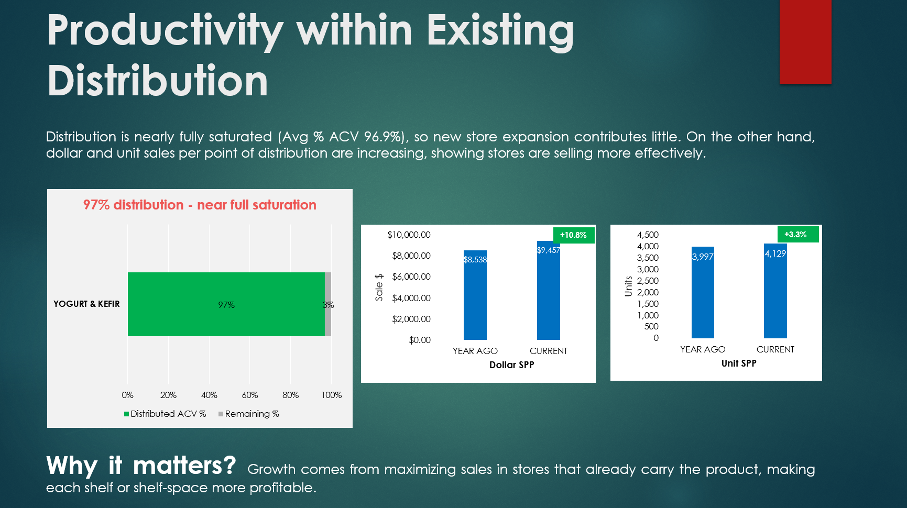
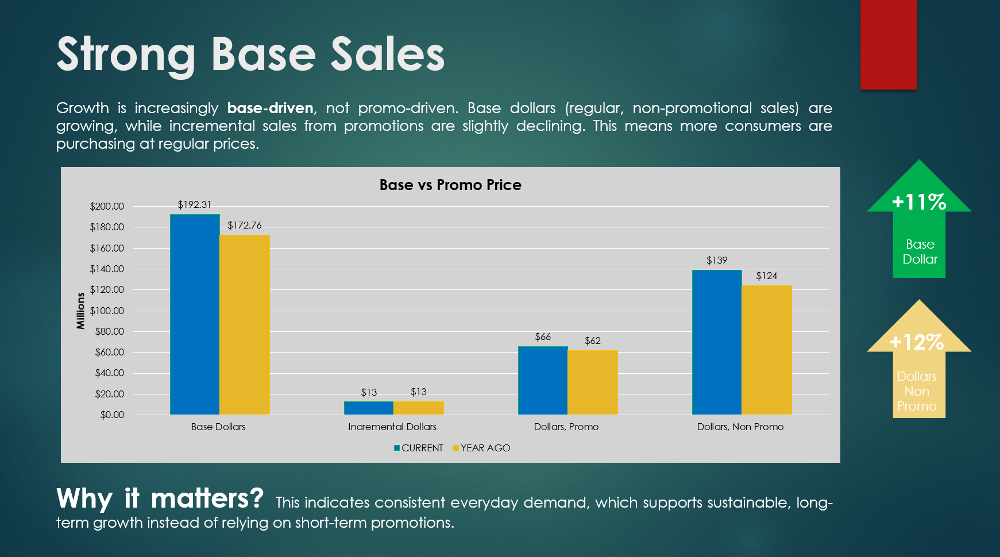
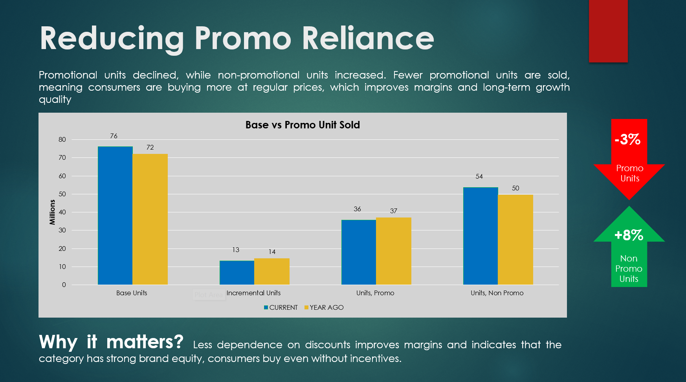

# Roberto's Yogurt & Kefir - Breaking Down the 10.3% YOY Growth

## Project Background

Roberto’s Yogurt & Kefir is a specialty dairy brand focused on crafting fresh, probiotic-rich yogurt and kefir beverages made from high-quality natural ingredients. The brand is dedicated to promoting better gut health, balanced nutrition, and delicious everyday wellness through carefully fermented dairy products.

Roberto is the Yogurt & Kefir category leader in the Natural Channel. While the category has grown substantially, Roberto’s sales performance has been flat.
As a data analyst my task is to provide perspective on the following:

- What is driving category growth?
- What should Roberto do to defend it’s position and win in the Natural Channel?

Insights and recommendations are provided on the following key areas:
- **Pricing Performance**: Looking at how the price and the number of products sold affect total sales.
- **Distribution Analysis**: Checking if opening new stores helps increase sales.
- **Promotional Performance**: Looking at how promotions or special offers help increase sales.

## Data Structure & Initial Checks

## Executive Summary
### Overview of findings
The Yogurt and Kefir category generated $204.8 million in sales, representing a 10.3% increase compared to last year, with an absolute dollar growth of $19.1 million.

This growth indicates strong category demand and improved market performance over the previous year.

### Pricing Trends:

### Distribution and Availability:

### Base vs Incremental Sales:

### Promotional Performance:

## Strategic Recommendations
Growth is driven by improved store productivity, supported by pricing expansion and reduced dependence on promotions. Consumers are absorbing higher price points while overall demand remains stable. Revenue per distribution point has increased, and performance is increasingly fueled by base sales rather than promotional activity.

### For manufacturers:
- Maintain pricing power
- Optimize promo depth
- Focus on premium innovation

### For retailers:
- Protect margin (less promo dependency)
- Maintain shelf stability
- Prioritize high-velocity SKUs
